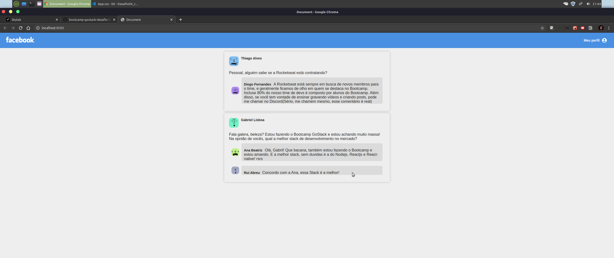

# Desafio de número 04 do bootcamp GoStack da Rocketseat ::rocket::

# Objetivos:

Crie uma aplicação do zero utilizando Webpack, Babel, Webpack Dev Server e ReactJS.

Nessa aplicação você irá desenvolver uma interface semelhante com a do Facebook utilizando React.

As informações contidas na interface são estáticas e não precisam refletir nenhuma API REST ou back-end.

# Tela da aplicação 

 
